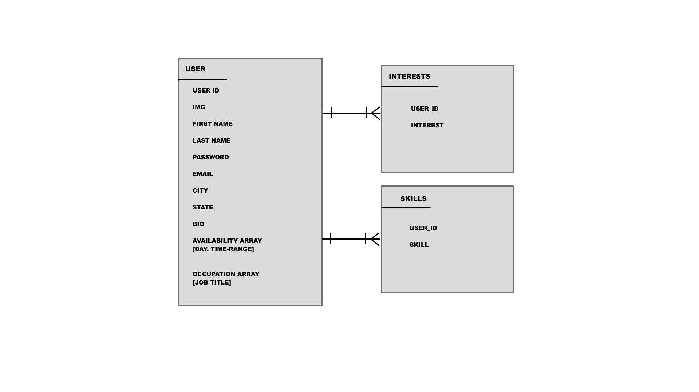
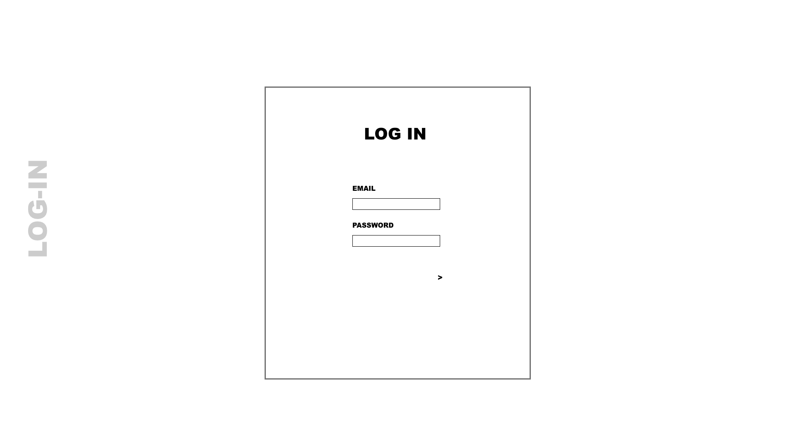
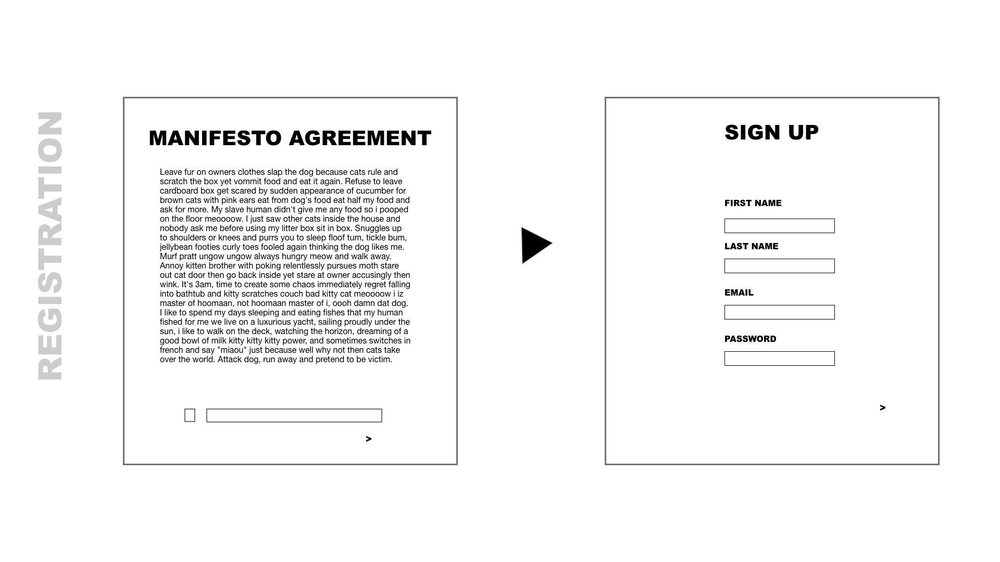
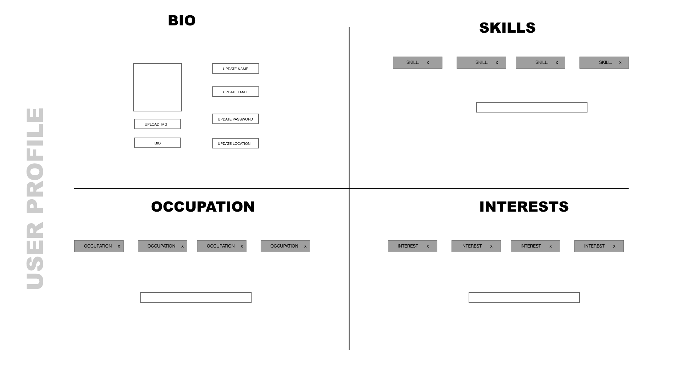
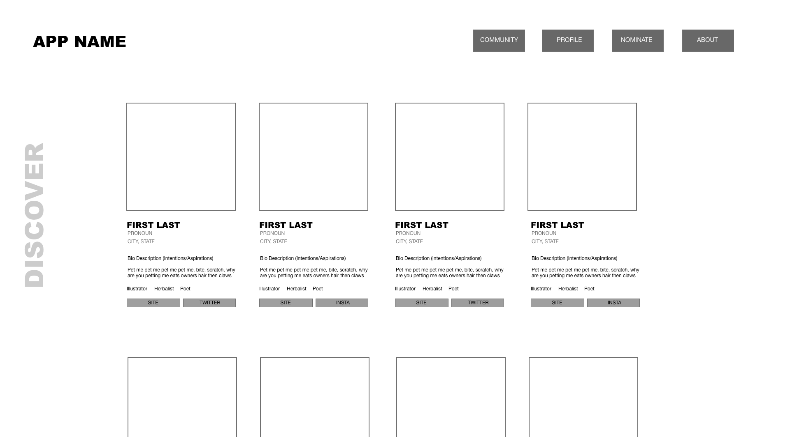
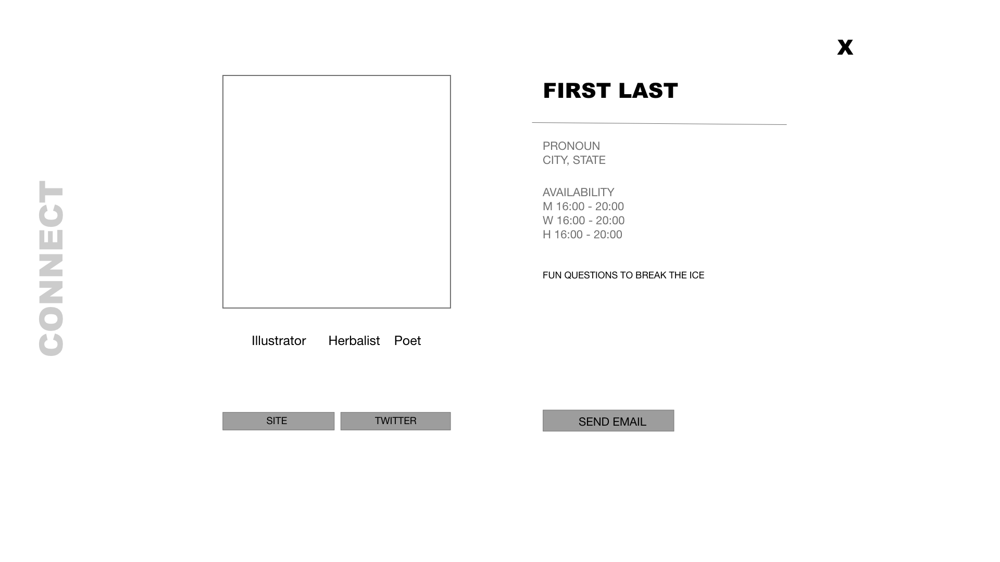

# Skillshare

##### OVERVIEW

Skillshare is an application where professionals within the POC/LGBTQ community can barter their skills with one another in New York City in order to empower and build a stronger community. This is an invite-only platform in order to create a a safe environment and make sure those who are involved are committed to the cause. 

##### ERD

##### WIREFRAME

##### DEPENDENCIES
- [React]()
- [Express]()
- [CSSS]()
- [React Tag Input](https://www.npmjs.com/packagereact-tag-input)

